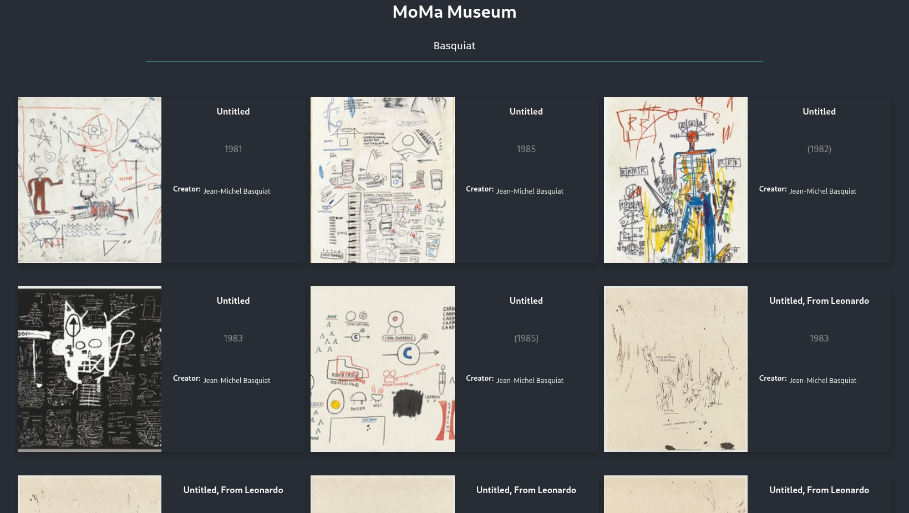

# MoMa Museum Viewer 🖼️

## 📚 About

The Museum Viewer is a simple web application that allows you to view and explore the [Museum of Modern Art](https://www.moma.org/).

The viewer is a [React](https://reactjs.org/) application that uses [React-Router](https://reacttraining.com/react-router/web/guides/quick-start) to navigate the application.

## 📷 Preview

## 🔧 Installation

First you need to install Flask depencencies:

    cd backend
    python -m venv venv
    source venv/bin/activate
    pip install -r requirements.txt
    python app.py

Then you need to install the frontend dependencies:

    npm i
    npm start || yarn start
